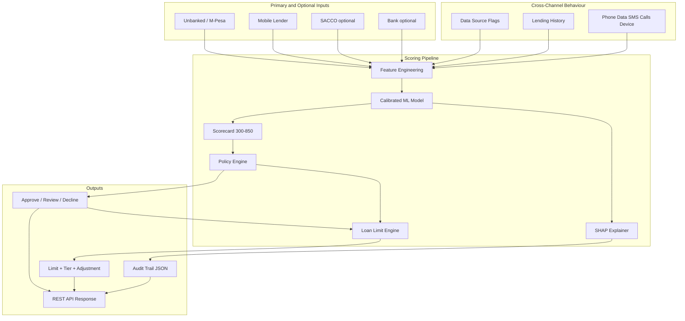
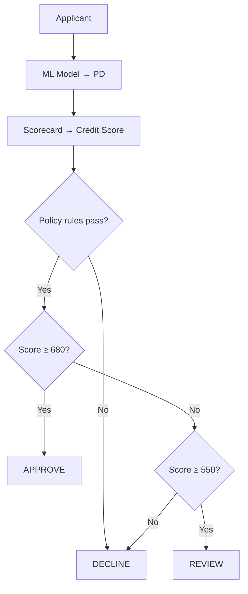

# East Africa Credit Scoring Engine

An **unbanked-first** credit scoring platform for East Africa. Most applicants have no traditional bank account — scoring relies on **M-Pesa**, **phone data** (SMS, call log, device tech), and **statements**, with **bank**, **SACCO**, and **CRB** data used when available.

It combines channel-specific feature engineering, a calibrated ML model, scorecard conversion (300–850), deterministic policy rules, **SHAP explainability**, loan limit assignment, and a **FastAPI REST service** with regulatory audit trails.

## Platform at a glance

| Capability | Status | Entry point |
|------------|--------|-------------|
| Multi-channel scoring (unbanked / M-Pesa / SACCO / bank / mobile lender) | ✅ | `score.py`, `/score` |
| Loan limit assignment (increase / decrease / maintain) | ✅ | `src/lending/limit_engine.py` |
| Borrowing & repayment history (all channels) | ✅ | `lending_history` in API |
| Unbanked-first scoring (`channel: unbanked`) | ✅ | M-Pesa + phone; bank optional |
| Optional bank / SACCO / CRB enrichment | ✅ | `data_sources` flags |
| Phone tech (OS, RAM, tier, network) | ✅ | `phone_data.device` |
| Phone data (SMS, call log, contacts, apps) | ✅ | `phone_data`, `src/data/phone_data.py` |
| ML training + evaluation (AUC, Gini, KS) | ✅ | `train.py` |
| Calibrated probability of default (PD) | ✅ | `src/ml/trainer.py` |
| Scorecard mapping (PDO methodology) | ✅ | `src/ml/scorer.py` |
| Policy engine (CRB, DTI, channel rules) | ✅ | `src/policy/engine.py` |
| SHAP feature explainability | ✅ | `src/ml/explainability.py` |
| Regulatory audit trail (JSON) | ✅ | `assets/audit_trails/` |
| FastAPI REST service | ✅ | `serve.py` → port 8000 |
| OpenAPI / Swagger docs | ✅ | `/docs` |
| Synthetic training data (no PII) | ✅ | `src/data/synthetic.py` |

## Table of contents

- [Install](#install)
- [Verify it works](#verify-it-works-copy-paste)
- [How to use this package](#how-to-use-this-package)
- [Supported channels](#supported-channels)
- [Data sources](#data-sources--statements-not-third-party-apis)
- [Architecture](#architecture)
- [End-to-end workflow](#end-to-end-workflow)
- [Project structure](#project-structure)
- [Training (`train.py`)](#1-training-trainpy)
- [CLI scoring (`score.py`)](#2-cli-scoring-scorepy)
- [REST API (`serve.py`)](#3-rest-api-servepy)
- [Programmatic API (Python)](#programmatic-api-python)
- [Statement & phone parsers](#statement--phone-parsers)
- [Decision logic](#decision-logic)
- [SHAP explainability & audit trails](#shap-explainability--audit-trails)
- [Configuration](#configuration)
- [Key metrics](#key-metrics)
- [Troubleshooting](#troubleshooting)
- [Documentation map](#documentation-map)
- [Design decisions](#design-decisions)
- [Roadmap](#roadmap)

## Install

```bash
cd credit_scoring
python3 -m venv .venv
source .venv/bin/activate        # Windows: .venv\Scripts\activate
pip install -r requirements.txt
```

Requires **Python 3.10+**. Dependencies: scikit-learn, pandas, numpy, matplotlib, pyyaml, joblib, fastapi, uvicorn, shap, pydantic.

> Install `scikit-learn`, not the deprecated PyPI package `sklearn`.

## Verify it works (copy-paste)

**Step 1 — train a model** (generates `models/` + `assets/`):

```bash
cd credit_scoring
source .venv/bin/activate
python3 train.py
# Expect: ROC-AUC ~0.90, model saved to models/
```

**Step 2 — score sample applicants** (SHAP + audit trails):

```bash
python3 score.py
# Expect: 7 applicants scored; assets/sample_decisions.json written
```

**Step 3 — start the REST API** (loads latest model from `models/latest_model.txt`):

```bash
python3 serve.py
# → http://127.0.0.1:8000/docs
```

**Step 4 — health check + unbanked score** (second terminal):

```bash
curl -s http://127.0.0.1:8000/health | python3 -m json.tool

curl -s -X POST http://127.0.0.1:8000/score \
  -H "Content-Type: application/json" \
  -d '{
    "applicant_id": "UNBANKED-001",
    "channel": "unbanked",
    "age": 29,
    "monthly_income_kes": 28000,
    "requested_amount_kes": 12000,
    "existing_debt_kes": 2000,
    "crb_defaults": 0,
    "crb_inquiries_6m": 0,
    "include_shap": true,
    "persist_audit_trail": true,
    "data_sources": {
      "has_mpesa_wallet": 1.0,
      "has_phone_consent": 1.0,
      "has_bank_account": 0.0,
      "has_sacco_membership": 0.0,
      "has_crb_record": 0.0
    },
    "lending_history": {
      "lifetime_loans_count": 4,
      "lifetime_repayment_rate": 1.0,
      "on_time_repayment_streak": 4,
      "highest_prior_limit_kes": 8000
    },
    "phone_data": {
      "alternative_data_consent": 1.0,
      "sms": { "sms_salary_detected": 1.0, "sms_gambling_ratio": 0.04 },
      "calls": { "call_collection_agency_count_30d": 0 },
      "device": { "device_tier": 2, "device_ram_gb": 4 }
    },
    "mpesa_features": {
      "kyc_tier": 2,
      "wallet_activity_days_90d": 72,
      "avg_monthly_txn_count": 58,
      "avg_txn_amount_kes": 1800,
      "cash_in_out_ratio": 1.05,
      "merchant_spend_ratio": 0.28,
      "fuliza_utilization": 0.12,
      "wallet_balance_volatility": 0.22,
      "days_since_last_txn": 1
    }
  }' | python3 -m json.tool
```

Or use Make:

```bash
make train           # python3 train.py
make score           # python3 score.py
make serve           # python3 serve.py
make verify          # train + score (no live API)
```

## How to use this package

East Africa Credit Scoring is a **Python library + REST service**, not a hosted SaaS. You train a model on your data (or synthetic data for demos), then score applicants via CLI, HTTP, or direct Python imports.

### Choose an integration path

| Path | When to use | Entry point |
|------|-------------|-------------|
| **REST API** | Production lending app, mobile backend | `serve.py` → `POST /score` |
| **CLI batch** | Demos, regression checks, audit samples | `score.py` |
| **Programmatic Python** | Custom pipelines, notebooks, ETL | `CreditScorer.from_latest()` |
| **Train / retrain** | New data, config changes, new channels | `train.py` |

### Step 1 — Install and train

```bash
pip install -r requirements.txt
python3 train.py
```

Training writes versioned artifacts to `models/` and evaluation reports to `assets/`. The API and scorer load the model named in `models/latest_model.txt`.

### Step 2 — Build an applicant payload

Every score needs:

| Block | Required? | Purpose |
|-------|-----------|---------|
| Core fields | Yes | `applicant_id`, `channel`, `age`, `monthly_income_kes`, `requested_amount_kes`, `existing_debt_kes`, `crb_*` |
| `data_sources` | Yes | Flags for M-Pesa, phone consent, bank, SACCO, CRB availability |
| `lending_history` | Recommended | Your institution's loan ledger (repeat customers) |
| `phone_data` | Strongly recommended | SMS, calls, device tech (unbanked path) |
| Channel features | Per channel | `mpesa_features`, `sacco_features`, `bank_features`, or `mobile_lender_features` |

Set `channel` to one of: `unbanked`, `mpesa`, `sacco`, `bank`, `mobile_lender`.

Bank and SACCO features are **scored only when** `has_bank_account` / `has_sacco_membership` is `1.0` — unbanked applicants are not penalised for missing bank data.

### Step 3 — Score

**HTTP** — start `serve.py`, then `POST /score` or `POST /score/batch` (see [REST API](#3-rest-api-servepy)).

**CLI** — edit `sample_applicants()` in `score.py` or call `CreditScorer` from your own script.

**Python** — see [Programmatic API](#programmatic-api-python).

### Step 4 — Interpret the response

| Field | Meaning |
|-------|---------|
| `credit_score` | 300–850 scorecard score (PDO methodology) |
| `probability_of_default` | Calibrated PD (0–1) |
| `decision` | `approve` (≥680), `review` (550–679), or `decline` (<550 or policy fail) |
| `policy.reasons` | Hard-rule decline reasons (independent of ML) |
| `loan_limit` | Assigned limit, tier, and adjustment (`increase` / `decrease` / `maintain`) |
| `shap` | Feature-level risk contributions (when `include_shap: true`) |
| `audit_id` | Regulatory audit file in `assets/audit_trails/` (when persisted) |

### Step 5 — Tune and retrain

Edit thresholds in [`config/scoring.yaml`](config/scoring.yaml) — scorecard bands, policy rules, channel minimums, loan limits. Then re-run `python3 train.py` if feature definitions change.

**Currency:** all amounts are **KES** (Kenyan Shillings). Income, debt, limits, and balances use whole shillings unless noted.

## Supported channels

| Channel | `channel` value | API feature block | Examples |
|---------|-----------------|-------------------|----------|
| Unbanked (primary) | `unbanked` | `mpesa_features` + `phone_data` | No bank account; M-Pesa + phone only |
| M-Pesa mobile money | `mpesa` | `mpesa_features` | Telco-led lending, Fuliza |
| Mobile digital lender | `mobile_lender` | `mobile_lender_features` | App-based short-term lenders |
| SACCO | `sacco` | `sacco_features` | Co-operative societies |
| Bank | `bank` | `bank_features` | Traditional bank accounts |

## Data sources — statements, not third-party APIs

Other digital lenders **do not share internal platform data**. This platform is designed around what you can actually obtain:

| Source | Required for unbanked? | Used for |
|--------|------------------------|----------|
| **M-Pesa wallet** | Yes (primary rail) | `mpesa_features`, `has_mpesa_wallet` |
| **Phone (SMS, calls, device tech)** | Strongly recommended | `phone_data` → `sms` / `calls` / `device` |
| **Your loan ledger** | If repeat customer | `lending_history` |
| **M-Pesa statement** | Optional (cross-lender signals) | `mobile_lender_features` / statement parser |
| **Bank statement** | Optional | `bank_features` when `has_bank_account: 1` |
| **SACCO statement** | Optional | `sacco_features` when `has_sacco_membership: 1` |
| **CRB** | Optional | `crb_*` when `has_crb_record: 1` |

Set availability explicitly via the `data_sources` block:

```json
"data_sources": {
  "has_mpesa_wallet": 1.0,
  "has_phone_consent": 1.0,
  "has_bank_account": 0.0,
  "has_sacco_membership": 0.0,
  "has_crb_record": 0.0
}
```

Bank and SACCO features are **included in the score only when their flag is set** — unbanked applicants are not penalised for missing bank data.

The model uses **89 features** total:

| Group | Count | Notes |
|-------|-------|-------|
| Common | 8 | Age, income, debt, CRB |
| Lending history | 11 | Your institution's ledger only |
| Data source flags | 5 | What data was available |
| Phone data | 31 | SMS (10) + calls (7) + device/apps (5) + device tech (8) + consent |
| Channel-specific | 34 | M-Pesa (9), SACCO (8), bank (8), mobile lender (9) — masked by channel/flags |

Phone features are zeroed when `alternative_data_consent` / `has_phone_consent` is not granted. Bank and SACCO channel columns activate only when their `data_sources` flag is set.

## Architecture



| Layer | Module | Responsibility |
|-------|--------|----------------|
| **Feature engineering** | `src/features/engineering.py` | Channel masking; optional bank/SACCO when `data_sources` flags set; phone consent gating |
| **Statement parser** | `src/data/statements.py` | M-Pesa statement → cross-lender features (no third-party APIs) |
| **Phone parser** | `src/data/phone_data.py` | SMS, call log, device tech → phone features |
| **ML model** | `src/ml/trainer.py` | Gradient boosting with sigmoid calibration |
| **Scorecard** | `src/ml/scorer.py` | PD → credit score using PDO (Points to Double Odds) |
| **Policy engine** | `src/policy/engine.py` | Hard rules: CRB defaults, DTI caps, channel minimums |
| **Loan limit engine** | `src/lending/limit_engine.py` | Assigns limits from score, repayment history, phone/SMS/call signals |
| **SHAP explainability** | `src/ml/explainability.py` | Per-feature risk contributions for audit/disclosure |
| **Audit trails** | `src/ml/explainability.py` | Timestamped JSON records for compliance review |
| **REST API** | `src/api/app.py` | Typed HTTP interface with Pydantic validation |

## End-to-end workflow

```
1. train.py          →  synthetic portfolio  →  train model  →  models/ + assets/
2. score.py          →  sample applicants    →  score + SHAP  →  assets/audit_trails/
3. serve.py          →  load latest model    →  REST API      →  live scoring + audits
```

## Channel coverage

One unified model serves **five channels**. Primary path is **`unbanked`** (M-Pesa + phone). Bank and SACCO features activate only when `data_sources` flags are set — thin-file applicants are not penalised for missing bank data.

### Unbanked (primary path)

Uses **`mpesa_features`** + **`phone_data`** + **`data_sources`**. No bank account required. Relaxed wallet policy vs full M-Pesa channel (KYC tier ≥ 1, ≥ 20 active wallet days).

| Config key | Threshold |
|------------|-----------|
| `min_kyc_tier` | 1 |
| `max_fuliza_utilization` | 0.90 |
| `min_wallet_activity_days_90d` | 20 |

**Typical unbanked applicant:** M-Pesa wallet + phone SMS/calls/device tech. Optionally add `bank_features` with `has_bank_account: 1` if they also have a bank account.

### M-Pesa (mobile money)

| Feature | Description |
|---------|-------------|
| `kyc_tier` | KYC verification level (1–3) |
| `wallet_activity_days_90d` | Active wallet days in last 90 days |
| `avg_monthly_txn_count` | Average monthly transaction count |
| `avg_txn_amount_kes` | Average transaction amount (KES) |
| `cash_in_out_ratio` | Cash-in vs cash-out ratio |
| `merchant_spend_ratio` | Share of spend at merchants |
| `fuliza_utilization` | Fuliza/overdraft utilization (0–1) |
| `wallet_balance_volatility` | Balance fluctuation measure |
| `days_since_last_txn` | Recency of last transaction |

**Policy checks:** minimum KYC tier (≥ 2), max Fuliza utilization (≤ 85%), minimum wallet activity (≥ 30 days in 90d).

| Config key | Threshold |
|------------|-----------|
| `min_kyc_tier` | 2 |
| `max_fuliza_utilization` | 0.85 |
| `min_wallet_activity_days_90d` | 30 |

### SACCO (co-operative lending)

| Feature | Description |
|---------|-------------|
| `membership_months` | Tenure as SACCO member |
| `share_capital_kes` | Share capital contributed (KES) |
| `monthly_savings_kes` | Regular monthly savings (KES) |
| `savings_consistency_score` | Consistency of savings (0–1) |
| `prior_loan_repayment_rate` | Historical repayment rate within SACCO |
| `guarantor_count` | Number of guarantors |
| `guarantor_avg_score` | Average guarantor credit score |
| `dividend_years` | Years dividends received |

**Policy checks:** minimum membership (≥ 6 months), share capital (≥ KES 5,000), repayment rate (≥ 85%).

| Config key | Threshold |
|------------|-----------|
| `min_membership_months` | 6 |
| `min_share_capital_kes` | 5,000 |
| `min_repayment_rate` | 0.85 |

### Bank (traditional lending)

| Feature | Description |
|---------|-------------|
| `account_age_months` | Account tenure |
| `avg_monthly_balance_kes` | Average monthly balance (KES) |
| `salary_deposit_regularity` | Regularity of salary deposits (0–1) |
| `bounced_cheques_12m` | Bounced cheques in last 12 months |
| `overdraft_usage_ratio` | Overdraft utilization (0–1) |
| `credit_card_utilization` | Credit card utilization (0–1) |
| `existing_loan_count` | Number of existing loans |
| `branch_relationship_score` | Bank branch relationship strength (0–1) |

**Policy checks:** minimum account age (≥ 6 months), max bounced cheques (≤ 1 in 12m), minimum balance (≥ KES 10,000).

| Config key | Threshold |
|------------|-----------|
| `min_account_age_months` | 6 |
| `max_bounced_cheques_12m` | 1 |
| `min_avg_balance_kes` | 10,000 |

### Mobile digital lender

Mobile lenders score applicants using **M-Pesa statements plus their own ledger** — not data from other fintech platforms. Competitor activity (disbursements, repayments, stacking) is inferred from M-Pesa paybill/till lines and SMS.

| Feature | Description | Source |
|---------|-------------|--------|
| `mpesa_statement_days_covered` | Days of M-Pesa statement provided | M-Pesa statement |
| `mpesa_lender_disbursement_count_12m` | Incoming loans from known lender paybills | M-Pesa statement |
| `mpesa_lender_repayment_count_12m` | Outgoing repayments to digital lenders | M-Pesa statement |
| `mpesa_inferred_repayment_rate` | Repayment vs disbursement ratio from statement | M-Pesa statement |
| `mpesa_active_lender_count` | Distinct lenders with recent debits/credits | M-Pesa statement |
| `mpesa_avg_inferred_loan_kes` | Average inferred loan size (KES) | M-Pesa statement |
| `mpesa_late_repayment_events_12m` | Late/overdue payment signals on statement | M-Pesa statement |
| `mpesa_loan_rollover_signals_12m` | Extension/rollover fee patterns | M-Pesa statement |
| `mpesa_net_cashflow_kes_90d` | Net inflow minus outflow (90 days) | M-Pesa statement |

**Policy checks:** minimum statement coverage (≥ 60 days), inferred repayment rate (≥ 80%), max active lenders (≤ 2), max late events (≤ 3 in 12m).

| Config key | Threshold |
|------------|-----------|
| `min_mpesa_statement_days_covered` | 60 |
| `min_mpesa_inferred_repayment_rate` | 0.80 |
| `max_mpesa_active_lender_count` | 2 |
| `max_mpesa_late_repayment_events_12m` | 3 |

**Typical use cases:**
- First-time vs repeat borrower limits on your platform
- Detecting **loan stacking** across multiple digital lenders
- Pricing repeat borrowers with strong platform repayment history
- Declining applicants with excessive rollovers or CRB defaults

### Common features (all channels)

| Feature | Description |
|---------|-------------|
| `age` | Applicant age |
| `monthly_income_kes` | Declared monthly income (KES) |
| `requested_amount_kes` | Loan amount requested (KES) |
| `existing_debt_kes` | Existing debt obligations (KES) |
| `debt_to_income` | Derived: existing debt / income |
| `loan_to_income` | Derived: requested amount / income |
| `crb_defaults` | Active CRB default listings |
| `crb_inquiries_6m` | CRB inquiries in last 6 months |

### Lending history (all channels)

**Your institution's loan ledger only** — banks, SACCOs, and lenders populate this from their own core banking / loan management system. Other institutions do not share this data.

Cross-institution borrowing behaviour is inferred separately from **M-Pesa statements**, **SMS**, and **call log** (see mobile lender features and `phone_data`).

### Data source flags (all channels)

| Feature | Description |
|---------|-------------|
| `has_mpesa_wallet` | M-Pesa wallet data available |
| `has_phone_consent` | Applicant granted SMS/call/device access |
| `has_bank_account` | Bank statement or account data available |
| `has_sacco_membership` | SACCO membership data available |
| `has_crb_record` | CRB bureau record available |

When `has_crb_record` is 0, CRB default policy rules are skipped (appropriate for thin-file unbanked applicants).

| Feature | Description |
|---------|-------------|
| `lifetime_loans_count` | Total loans taken across all lenders |
| `lifetime_loans_repaid_on_time` | Loans repaid on or before due date |
| `lifetime_default_count` | Lifetime defaults / write-offs |
| `lifetime_repayment_rate` | On-time repayments / total loans (0–1) |
| `on_time_repayment_streak` | Consecutive on-time loans (most recent first) |
| `avg_days_past_due` | Average days late when overdue |
| `days_since_last_loan` | Recency of last borrowing |
| `days_since_last_default` | Recency of last default (9999 if none) |
| `current_outstanding_kes` | Total outstanding debt (KES) |
| `highest_prior_limit_kes` | Highest limit previously granted (for adjustments) |
| `months_customer_relationship` | Months as a customer with your institution |

These features feed both the **ML model** (default risk) and the **loan limit engine** (increase/decrease logic).

### Phone data (SMS, call log, device — all channels)

Collected **on the applicant's phone** with explicit consent. No competitor APIs — the app reads SMS inbox, call history, contacts, and installed apps locally, then sends derived features to `/score`.

**API structure** (`phone_data` block):

```json
"phone_data": {
  "alternative_data_consent": 1.0,
  "sms": {
    "sms_salary_detected": 1.0,
    "sms_inferred_monthly_income_kes": 83300,
    "sms_mpesa_txn_count_30d": 72,
    "sms_total_count_30d": 118,
    "sms_bill_pay_regularity": 0.91,
    "sms_other_lender_repayment_count": 1,
    "sms_collection_message_count_30d": 0,
    "sms_lender_promo_count_30d": 1,
    "sms_gambling_ratio": 0.04,
    "income_declared_vs_sms_ratio": 0.98
  },
  "calls": {
    "call_total_count_30d": 64,
    "call_unique_contacts_30d": 28,
    "call_avg_duration_seconds": 145,
    "call_incoming_ratio": 0.62,
    "call_missed_ratio": 0.11,
    "call_collection_agency_count_30d": 0,
    "call_night_activity_ratio": 0.06
  },
  "device": {
    "device_tenure_days": 540,
    "contacts_count": 210,
    "contacts_saved_ratio": 0.88,
    "apps_lending_app_count": 1,
    "apps_gambling_app_count": 0,
    "device_os_android": 1.0,
    "device_os_version_score": 0.87,
    "device_tier": 2,
    "device_ram_gb": 4,
    "device_storage_free_ratio": 0.42,
    "device_dual_sim": 1.0,
    "device_network_4g_plus": 1.0,
    "device_model_age_months": 18
  }
}
```

| Group | Feature | Description |
|-------|---------|-------------|
| **SMS** | `sms_salary_detected` | Salary M-Pesa SMS pattern (0/1) |
| **SMS** | `sms_collection_message_count_30d` | Debt-collection SMS count |
| **SMS** | `sms_lender_promo_count_30d` | Loan marketing SMS (stacking signal) |
| **SMS** | `sms_gambling_ratio` | Gambling-related SMS share |
| **Calls** | `call_collection_agency_count_30d` | Calls from collectors / lenders |
| **Calls** | `call_missed_ratio` | Missed call ratio (stress proxy) |
| **Calls** | `call_night_activity_ratio` | Calls between 10pm–6am |
| **Device** | `contacts_count` | Phone book size |
| **Device** | `apps_lending_app_count` | Installed digital lending apps |
| **Device tech** | `device_os_android`, `device_os_version_score` | OS type and recency |
| **Device tech** | `device_tier`, `device_ram_gb` | Handset class (1=budget, 3=premium) and RAM |
| **Device tech** | `device_network_4g_plus`, `device_dual_sim` | Connectivity profile |
| **Device tech** | `device_model_age_months`, `device_storage_free_ratio` | Handset age and storage headroom |

Parse raw phone data with `src/data/phone_data.py` (`derive_phone_data_features()`). The legacy `alternative_data` API block still works as an alias.

## Loan limit engine

After scoring and policy checks, `LoanLimitEngine` assigns an **approved limit** (KES), a **tier**, and an **adjustment** action. The same engine works across all channels; limits are configured per channel in `config/scoring.yaml`.

| Adjustment | Meaning |
|------------|---------|
| `first_time` | No prior limit on record; starter limit from channel base |
| `increase` | New limit > 105% of prior limit (good streak / repayment) |
| `decrease` | New limit < 95% of prior limit (defaults, income cap, risk) |
| `maintain` | Within ±5% of prior limit |
| `suspended` | Decline or policy fail → limit KES 0 |

**Limit calculation flow:**

1. Start from `highest_prior_limit_kes` (repeat borrower) or `first_time_base_kes` (new borrower).
2. Apply score multiplier (`approve` 1.0, `review` 0.55, `decline` 0).
3. Adjust for repayment streak (3+ or 6+ on-time loans), lifetime rate, recent defaults.
4. Adjust for phone data (verified SMS income ↑, gambling / collection SMS/calls ↓, loan-stacking apps ↓).
5. Cap at `max_income_multiple × monthly_income` (default 40% of income).
6. Clamp to channel min/max; round to nearest KES 500.
7. Compare to prior limit → `increase`, `decrease`, or `maintain`.

**Tiers** (by approved limit): starter → bronze (≥ 15k) → silver (≥ 50k) → gold (≥ 150k) → platinum (≥ 300k).

**Per-channel limits** (config defaults):

| Channel | Min (KES) | Max (KES) | First-time base (KES) |
|---------|-----------|-----------|------------------------|
| `unbanked` | 500 | 50,000 | 3,000 |
| `mpesa` | 1,000 | 75,000 | 5,000 |
| `mobile_lender` | 500 | 100,000 | 3,000 |
| `sacco` | 5,000 | 500,000 | 25,000 |
| `bank` | 10,000 | 2,000,000 | 50,000 |

**Example:** `UNBANKED-001` with income KES 28,000, strong phone/M-Pesa profile, and prior limit KES 8,000 may receive KES 11,000 with `INCREASE`.

## Project structure

```
credit_scoring/
├── config/
│   └── scoring.yaml              # Thresholds, scorecard, channel rules
├── src/
│   ├── __init__.py
│   ├── config.py                 # Typed YAML config loader
│   ├── domain.py                 # Applicant, Decision, Policy models
│   ├── data/
│   │   ├── synthetic.py          # Synthetic portfolio generator
│   │   ├── statements.py         # M-Pesa statement → feature parser
│   │   └── phone_data.py         # SMS + call log → feature parser
│   ├── features/
│   │   └── engineering.py        # Feature matrix builder + channel masking
│   ├── ml/
│   │   ├── trainer.py            # Train, evaluate, persist model
│   │   ├── scorer.py             # Score applicants + audit integration
│   │   ├── explainability.py     # SHAP explainer + audit trail writer
│   │   └── metrics.py            # AUC, Gini, KS, Brier
│   ├── api/
│   │   ├── app.py                # FastAPI application
│   │   └── schemas.py            # Pydantic request/response models
│   ├── lending/
│   │   └── limit_engine.py       # Loan limit assign / adjust logic
│   ├── policy/
│       └── engine.py             # Business & regulatory rules
├── train.py                      # Training entry point
├── score.py                      # CLI scoring + SHAP + audit trails
├── serve.py                      # Start FastAPI on port 8000
├── models/                       # Saved models (generated)
│   ├── credit_model_*.joblib
│   ├── credit_model_*.json       # Model metadata
│   └── latest_model.txt          # Pointer to active model
├── assets/                       # Reports (generated)
│   ├── training_metrics.json
│   ├── feature_importance.csv
│   ├── roc_curve.png
│   ├── sample_decisions.json
│   └── audit_trails/             # Regulatory audit JSON per score
├── requirements.txt
├── Makefile                      # make train | score | serve | verify
├── .gitignore
└── README.md
```

## Requirements

See [Install](#install). Quick recap:

- Python 3.10+
- `pip install -r requirements.txt`

## Quick start

See [Verify it works](#verify-it-works-copy-paste) for the full copy-paste flow. Minimum:

```bash
pip install -r requirements.txt
python3 train.py      # required before scoring or API
python3 score.py      # CLI demo with SHAP + audits
python3 serve.py      # REST API on :8000
```

---

## 1. Training (`train.py`)

Generates a synthetic portfolio and trains a calibrated gradient boosting classifier.

```bash
python3 train.py
```

**What it does:**

1. Generates 8,000 synthetic applicants (35% unbanked, 20% M-Pesa, 20% mobile lender, 15% SACCO, 10% bank).
2. Splits 80/20 train/test with stratification on default label.
3. Trains `GradientBoostingClassifier` wrapped in `CalibratedClassifierCV`.
4. Evaluates on hold-out test set.
5. Saves versioned artifacts to `models/` and `assets/`.

**Latest training metrics** (synthetic portfolio):

| Metric | Value |
|--------|-------|
| ROC-AUC | 0.905 |
| Gini | 0.809 |
| KS | 0.803 |
| Brier score | 0.060 |
| Test accuracy | 0.903 |
| Precision | 0.579 |
| Recall | 0.688 |
| Default rate | 12% |
| Feature count | 89 |
| Model version | 2.3.0 |
| Train / test split | 6,400 / 1,600 |

**Generated artifacts:**

| File | Contents |
|------|----------|
| `models/credit_model_*.joblib` | Serialized sklearn pipeline |
| `models/credit_model_*.json` | Feature list, scorecard, metrics |
| `models/latest_model.txt` | Pointer to active model |
| `assets/training_metrics.json` | Full evaluation report |
| `assets/feature_importance.csv` | Model feature importances |
| `assets/roc_curve.png` | ROC curve plot |

---

## 2. CLI scoring (`score.py`)

Scores **seven** sample applicants — unbanked-first plus M-Pesa, SACCO, bank, mobile lender, and two high-risk cases. Each score includes SHAP explainability, loan limits, and a persisted audit trail.

```bash
python3 score.py
```

**Sample output:**

```
UNBANKED-001   | channel=unbanked      | score=683 | limit=KES 11,000 | INCREASE  | decision=APPROVE
MPESA-001      | channel=mpesa         | score=683 | limit=KES 34,000 | DECREASE  | decision=APPROVE
SACCO-014      | channel=sacco         | score=683 | limit=KES 48,000 | DECREASE  | decision=APPROVE
BANK-203       | channel=bank          | score=634 | limit=KES 5,000  | DECREASE  | decision=REVIEW
MOBLEND-001    | channel=mobile_lender | score=683 | limit=KES 19,000 | MAINTAIN  | decision=APPROVE
MOBLEND-RISK-99 | channel=mobile_lender | score=550 | limit=KES 0      | SUSPENDED | decision=DECLINE
MPESA-RISK-77  | channel=mpesa         | score=556 | limit=KES 0      | SUSPENDED | decision=DECLINE
```

Re-run `python3 train.py` then `python3 score.py` after config or feature changes to refresh scores.

**Sample applicants scored by `score.py`:**

| ID | Channel | Scenario |
|----|---------|----------|
| `UNBANKED-001` | `unbanked` | No bank account; M-Pesa + phone only → APPROVE |
| `MPESA-001` | `mpesa` | Strong M-Pesa wallet profile → APPROVE |
| `SACCO-014` | `sacco` | Long-tenure SACCO member → APPROVE |
| `BANK-203` | `bank` | Solid bank relationship → REVIEW |
| `MOBLEND-001` | `mobile_lender` | Repeat borrower; M-Pesa statement signals → APPROVE |
| `MOBLEND-RISK-99` | `mobile_lender` | Loan stacking + CRB default → DECLINE |
| `MPESA-RISK-77` | `mpesa` | High Fuliza use + CRB default → DECLINE |

**Generated artifacts:**

| File | Contents |
|------|----------|
| `assets/sample_decisions.json` | All sample scores with SHAP payloads |
| `assets/audit_trails/{audit_id}.json` | One regulatory audit file per applicant |

---

## 3. REST API (`serve.py`)

Production-ready FastAPI service that loads the latest trained model at startup.

```bash
python3 serve.py
```

- **Swagger UI:** [http://127.0.0.1:8000/docs](http://127.0.0.1:8000/docs)
- **ReDoc:** [http://127.0.0.1:8000/redoc](http://127.0.0.1:8000/redoc)
- **Base URL:** `http://127.0.0.1:8000`

### Endpoints

| Endpoint | Method | Description |
|----------|--------|-------------|
| `/health` | GET | Service health and model load status |
| `/model/info` | GET | Active model version, scorecard, decision bands |
| `/score` | POST | Score one applicant (SHAP + audit optional) |
| `/score/batch` | POST | Score up to 100 applicants in one request |

### `GET /health`

```bash
curl http://127.0.0.1:8000/health
```

```json
{
  "status": "ok",
  "model_loaded": true,
  "model_version": "2.3.0"
}
```

### `GET /model/info`

```bash
curl http://127.0.0.1:8000/model/info
```

Returns project name, model file, feature count, scorecard settings, and decision bands.

### `POST /score`

Score a single applicant. Include **`data_sources`**, **`lending_history`**, and **`phone_data`** (recommended for unbanked). Optional **`bank_features`** / **`sacco_features`** when flags are set. Set `include_shap: true` and `persist_audit_trail: true` for full regulatory output.

**Shared blocks** (all channels):

```json
"data_sources": {
  "has_mpesa_wallet": 1.0,
  "has_phone_consent": 1.0,
  "has_bank_account": 0.0,
  "has_sacco_membership": 0.0,
  "has_crb_record": 0.0
},
"lending_history": {
  "lifetime_loans_count": 10,
  "lifetime_loans_repaid_on_time": 10,
  "lifetime_default_count": 0,
  "lifetime_repayment_rate": 1.0,
  "on_time_repayment_streak": 7,
  "avg_days_past_due": 0.5,
  "days_since_last_loan": 20,
  "days_since_last_default": 9999,
  "current_outstanding_kes": 8000,
  "highest_prior_limit_kes": 40000,
  "months_customer_relationship": 24
},
"phone_data": {
  "alternative_data_consent": 1.0,
  "sms": {
    "sms_salary_detected": 1.0,
    "sms_inferred_monthly_income_kes": 83300,
    "sms_mpesa_txn_count_30d": 72,
    "sms_total_count_30d": 118,
    "sms_bill_pay_regularity": 0.91,
    "sms_other_lender_repayment_count": 1,
    "sms_collection_message_count_30d": 0,
    "sms_lender_promo_count_30d": 1,
    "sms_gambling_ratio": 0.04,
    "income_declared_vs_sms_ratio": 0.98
  },
  "calls": {
    "call_total_count_30d": 64,
    "call_unique_contacts_30d": 28,
    "call_avg_duration_seconds": 145,
    "call_incoming_ratio": 0.62,
    "call_missed_ratio": 0.11,
    "call_collection_agency_count_30d": 0,
    "call_night_activity_ratio": 0.06
  },
  "device": {
    "device_tenure_days": 540,
    "contacts_count": 210,
    "contacts_saved_ratio": 0.88,
    "apps_lending_app_count": 1,
    "apps_gambling_app_count": 0,
    "device_os_android": 1.0,
    "device_os_version_score": 0.87,
    "device_tier": 2,
    "device_ram_gb": 4,
    "device_storage_free_ratio": 0.42,
    "device_dual_sim": 1.0,
    "device_network_4g_plus": 1.0,
    "device_model_age_months": 18
  }
}
```

> The flat `alternative_data` block still works as a deprecated alias for `phone_data`.

**Unbanked example** (primary path):

```bash
curl -X POST http://127.0.0.1:8000/score \
  -H "Content-Type: application/json" \
  -d '{
    "applicant_id": "UNBANKED-001",
    "channel": "unbanked",
    "age": 29,
    "monthly_income_kes": 28000,
    "requested_amount_kes": 12000,
    "existing_debt_kes": 2000,
    "crb_defaults": 0,
    "crb_inquiries_6m": 0,
    "include_shap": true,
    "persist_audit_trail": true,
    "data_sources": {
      "has_mpesa_wallet": 1.0,
      "has_phone_consent": 1.0,
      "has_bank_account": 0.0,
      "has_sacco_membership": 0.0,
      "has_crb_record": 0.0
    },
    "lending_history": {
      "lifetime_loans_count": 4,
      "lifetime_repayment_rate": 1.0,
      "on_time_repayment_streak": 4,
      "highest_prior_limit_kes": 8000
    },
    "phone_data": {
      "alternative_data_consent": 1.0,
      "sms": { "sms_salary_detected": 1.0, "sms_gambling_ratio": 0.04 },
      "calls": { "call_collection_agency_count_30d": 0 },
      "device": { "device_tier": 2, "device_ram_gb": 4, "device_network_4g_plus": 1.0 }
    },
    "mpesa_features": {
      "kyc_tier": 2,
      "wallet_activity_days_90d": 72,
      "avg_monthly_txn_count": 58,
      "avg_txn_amount_kes": 1800,
      "cash_in_out_ratio": 1.05,
      "merchant_spend_ratio": 0.28,
      "fuliza_utilization": 0.12,
      "wallet_balance_volatility": 0.22,
      "days_since_last_txn": 1
    }
  }'
```

**M-Pesa example:**

```bash
curl -X POST http://127.0.0.1:8000/score \
  -H "Content-Type: application/json" \
  -d '{
    "applicant_id": "MPESA-001",
    "channel": "mpesa",
    "age": 34,
    "monthly_income_kes": 85000,
    "requested_amount_kes": 50000,
    "existing_debt_kes": 5000,
    "crb_defaults": 0,
    "crb_inquiries_6m": 0,
    "include_shap": true,
    "persist_audit_trail": true,
    "data_sources": {
      "has_mpesa_wallet": 1.0,
      "has_phone_consent": 1.0,
      "has_bank_account": 0.0,
      "has_sacco_membership": 0.0,
      "has_crb_record": 0.0
    },
    "lending_history": {
      "lifetime_loans_count": 10,
      "lifetime_repayment_rate": 1.0,
      "on_time_repayment_streak": 7,
      "highest_prior_limit_kes": 40000,
      "lifetime_default_count": 0,
      "days_since_last_default": 9999
    },
    "phone_data": {
      "alternative_data_consent": 1.0,
      "sms": {
        "sms_salary_detected": 1.0,
        "sms_inferred_monthly_income_kes": 83300,
        "income_declared_vs_sms_ratio": 0.98,
        "sms_gambling_ratio": 0.04
      },
      "device": { "apps_lending_app_count": 1 }
    },
    "mpesa_features": {
      "kyc_tier": 3,
      "wallet_activity_days_90d": 88,
      "avg_monthly_txn_count": 95,
      "avg_txn_amount_kes": 4200,
      "cash_in_out_ratio": 0.95,
      "merchant_spend_ratio": 0.35,
      "fuliza_utilization": 0.05,
      "wallet_balance_volatility": 0.08,
      "days_since_last_txn": 0
    }
  }'
```

**SACCO example** — use `"channel": "sacco"` and provide `sacco_features`:

```json
"sacco_features": {
  "membership_months": 72,
  "share_capital_kes": 95000,
  "monthly_savings_kes": 18000,
  "savings_consistency_score": 0.97,
  "prior_loan_repayment_rate": 1.0,
  "guarantor_count": 4,
  "guarantor_avg_score": 760,
  "dividend_years": 6
}
```

**Bank example** — use `"channel": "bank"` and provide `bank_features`:

```json
"bank_features": {
  "account_age_months": 60,
  "avg_monthly_balance_kes": 280000,
  "salary_deposit_regularity": 0.98,
  "bounced_cheques_12m": 0,
  "overdraft_usage_ratio": 0.03,
  "credit_card_utilization": 0.12,
  "existing_loan_count": 0,
  "branch_relationship_score": 0.91
}
```

**Mobile digital lender example** — use `"channel": "mobile_lender"` and provide `mobile_lender_features`:

```bash
curl -X POST http://127.0.0.1:8000/score \
  -H "Content-Type: application/json" \
  -d '{
    "applicant_id": "MOBLEND-001",
    "channel": "mobile_lender",
    "age": 31,
    "monthly_income_kes": 48000,
    "requested_amount_kes": 15000,
    "existing_debt_kes": 8000,
    "crb_defaults": 0,
    "crb_inquiries_6m": 1,
    "include_shap": true,
    "persist_audit_trail": true,
    "data_sources": {
      "has_mpesa_wallet": 1.0,
      "has_phone_consent": 1.0,
      "has_bank_account": 0.0,
      "has_sacco_membership": 0.0,
      "has_crb_record": 0.0
    },
    "lending_history": {
      "lifetime_loans_count": 8,
      "lifetime_repayment_rate": 0.96,
      "on_time_repayment_streak": 5,
      "highest_prior_limit_kes": 20000
    },
    "phone_data": {
      "alternative_data_consent": 1.0,
      "sms": {
        "sms_salary_detected": 1.0,
        "sms_inferred_monthly_income_kes": 47000,
        "income_declared_vs_sms_ratio": 0.98
      },
      "device": { "apps_lending_app_count": 1 }
    },
    "mobile_lender_features": {
      "mpesa_statement_days_covered": 270,
      "mpesa_lender_disbursement_count_12m": 8,
      "mpesa_lender_repayment_count_12m": 9,
      "mpesa_inferred_repayment_rate": 0.96,
      "mpesa_active_lender_count": 1,
      "mpesa_avg_inferred_loan_kes": 12000,
      "mpesa_late_repayment_events_12m": 0,
      "mpesa_loan_rollover_signals_12m": 1,
      "mpesa_net_cashflow_kes_90d": 18500
    }
  }'
```

**Response fields:**

| Field | Description |
|-------|-------------|
| `probability_of_default` | Model-estimated PD (0–1) |
| `credit_score` | Scorecard score (300–850) |
| `decision` | `approve`, `review`, or `decline` |
| `policy.passed` | Whether hard policy rules passed |
| `policy.reasons` | Policy decline reasons (if any) |
| `loan_limit.approved_limit_kes` | Assigned loan limit (KES) |
| `loan_limit.adjustment` | `first_time`, `increase`, `decrease`, `maintain`, or `suspended` |
| `loan_limit.tier` | Limit tier: starter / bronze / silver / gold / platinum |
| `loan_limit.reasons` | Human-readable limit adjustment reasons |
| `loan_limit.next_review_days` | Days until limit re-evaluation |
| `top_risk_factors` | Rule-based risk factor summary |
| `shap` | SHAP explanation (if requested) |
| `audit_id` | Audit trail ID (if persisted) |
| `model_version` | Model version used for the decision |

**Example response (truncated):**

```json
{
  "applicant_id": "MOBLEND-001",
  "channel": "mobile_lender",
  "probability_of_default": 0.0162,
  "credit_score": 687,
  "decision": "approve",
  "policy": { "passed": true, "reasons": [] },
  "loan_limit": {
    "approved_limit_kes": 19000,
    "min_limit_kes": 500,
    "max_limit_kes": 100000,
    "prior_limit_kes": 20000,
    "requested_limit_kes": 15000,
    "adjustment": "maintain",
    "adjustment_pct": 0.0,
    "tier": "bronze",
    "reasons": ["Limit maintained based on current behaviour."],
    "next_review_days": 90
  },
  "shap": {
    "base_value": -3.529231,
    "predicted_log_odds": -4.412,
    "summary": "Primary drivers increasing default risk: none. Primary drivers reducing risk: mpesa_inferred_repayment_rate, lifetime_repayment_rate.",
    "contributions": [
      {
        "feature": "mpesa_inferred_repayment_rate",
        "raw_value": 0.96,
        "shap_value": -0.42,
        "impact": "decreases_default_risk"
      }
    ]
  },
  "audit_id": "MOBLEND-001-4fddb337",
  "model_version": "2.3.0"
}
```

### `POST /score/batch`

Score multiple applicants in one call. Batch defaults: `include_shap: false`, `persist_audit_trail: false` (override per applicant if needed).

```bash
curl -X POST http://127.0.0.1:8000/score/batch \
  -H "Content-Type: application/json" \
  -d '{
    "include_shap": false,
    "persist_audit_trail": false,
    "applicants": [
      {
        "applicant_id": "MPESA-001",
        "channel": "mpesa",
        "age": 34,
        "monthly_income_kes": 85000,
        "requested_amount_kes": 50000,
        "existing_debt_kes": 5000,
        "crb_defaults": 0,
        "crb_inquiries_6m": 0,
        "mpesa_features": { "...": "..." }
      }
    ]
  }'
```

---

## Programmatic API (Python)

Embed scoring in your own Python code without the REST server:

```python
from src.config import load_config
from src.domain import ApplicantProfile, Channel
from src.ml.scorer import CreditScorer

config = load_config()
scorer = CreditScorer.from_latest(config)

applicant = ApplicantProfile(
    applicant_id="UNBANKED-001",
    channel=Channel.UNBANKED,
    age=29,
    monthly_income_kes=28_000,
    requested_amount_kes=12_000,
    existing_debt_kes=2_000,
    crb_defaults=0,
    crb_inquiries_6m=0,
    features={
        # data_sources flags
        "has_mpesa_wallet": 1.0,
        "has_phone_consent": 1.0,
        "has_bank_account": 0.0,
        "has_sacco_membership": 0.0,
        "has_crb_record": 0.0,
        # lending_history
        "lifetime_loans_count": 4,
        "lifetime_repayment_rate": 1.0,
        "highest_prior_limit_kes": 8_000,
        # phone_data (flat keys in features dict for CLI/programmatic use)
        "alternative_data_consent": 1.0,
        "sms_salary_detected": 1.0,
        "sms_gambling_ratio": 0.04,
        "call_collection_agency_count_30d": 0,
        "device_tier": 2,
        # mpesa_features
        "kyc_tier": 2,
        "wallet_activity_days_90d": 72,
        "fuliza_utilization": 0.12,
    },
)

# Score without SHAP or audit (fast path)
decision = scorer.score_applicant(applicant)
print(decision.credit_score, decision.decision.value, decision.loan_limit.approved_limit_kes)

# Full score with SHAP + persisted audit trail
decision, shap, audit_id = scorer.score_with_audit(
    applicant,
    include_shap=True,
    persist_audit_trail=True,
    request_snapshot={"source": "my_app"},
)
```

Run from the project root (`credit_scoring/`) so `src` imports resolve. For a custom config path: `load_config("/path/to/scoring.yaml")`.

Batch scoring:

```python
decisions = scorer.score_batch([applicant1, applicant2])
```

---

## Statement & phone parsers

Convert raw customer uploads into model features before calling `/score` or `CreditScorer`.

### M-Pesa statement → mobile lender features

```python
from datetime import datetime
from src.data.statements import MpesaStatementLine, derive_mpesa_statement_features

lines = [
    MpesaStatementLine(
        date=datetime(2026, 1, 15),
        amount_kes=5000,
        direction="in",
        counterparty="Digital Lender XYZ",
        description="Loan disbursed",
    ),
    # ... more statement rows
]
features = derive_mpesa_statement_features(lines)
# → mpesa_lender_disbursement_count_12m, mpesa_inferred_repayment_rate, etc.
```

Pass the returned dict as `mobile_lender_features` in the API payload (with `"channel": "mobile_lender"`).

### Phone SMS / calls → phone features

```python
from datetime import datetime
from src.data.phone_data import (
    PhoneSmsMessage,
    PhoneCallRecord,
    derive_sms_features,
    derive_call_features,
    derive_device_features,
)

sms_feats = derive_sms_features([
    PhoneSmsMessage(datetime(2026, 6, 1, 9, 0), "MPESA", "You have received KES 28000 salary"),
])
call_feats = derive_call_features([
    PhoneCallRecord(datetime(2026, 6, 2, 14, 0), "incoming", 120.0),
])
device_feats = derive_device_features(
    device_tenure_days=540,
    contacts_count=210,
    saved_contacts_count=185,
    apps_lending_app_count=1,
    apps_gambling_app_count=0,
    os_name="android",
    os_version="13",
    device_tier=2,
    ram_gb=4,
    storage_free_ratio=0.42,
    dual_sim=True,
    network_4g_plus=True,
    model_age_months=18,
)
```

Merge into the API `phone_data` block (`sms`, `calls`, `device` sub-objects) or flat `features` dict for programmatic scoring.

---

## Decision logic

Final decisions combine **three independent layers**:



| Decision | Condition |
|----------|-----------|
| **APPROVE** | Policy passed **and** credit score ≥ 680 |
| **REVIEW** | Policy passed **and** 550 ≤ score < 680 |
| **DECLINE** | Policy failed **or** score < 550 |

Policy failures always result in **DECLINE**, regardless of credit score. Examples:

- Active **CRB default** when `has_crb_record: 1`
- **Debt-to-income** above 45% (all channels)
- Unbanked / M-Pesa **KYC tier** too low or **Fuliza** over-utilised
- SACCO **membership** or **share capital** below minimum (when `has_sacco_membership: 1`)
- Bank **bounced cheques** or low average balance (when `has_bank_account: 1`)
- Mobile lender **loan stacking** or **late repayments** on M-Pesa statement

### Scorecard formula

Credit scores use the industry-standard **PDO (Points to Double Odds)** method:

\[
\text{Score} = \text{Offset} + \text{Factor} \times \ln(\text{odds})
\]

where `Factor = PDO / ln(2)`, `Offset = base_score − Factor × ln(base_odds)`, and `odds = PD / (1 − PD)`.

Current settings (`config/scoring.yaml`):

| Setting | Value |
|---------|-------|
| Base score | 680 |
| Base odds | 50:1 |
| PDO | 20 |
| Score range | 300–850 |
| Approve band | ≥ 680 |
| Review band | ≥ 550 |

---

## SHAP explainability & audit trails

Every score can include a **SHAP (SHapley Additive exPlanations)** breakdown showing which features pushed default probability up or down. This supports:

- **CBK model risk management** guidelines
- **Consumer disclosure** (why was my application declined?)
- **Internal audit** and fair-lending reviews

### How SHAP is used here

1. Applicant features are preprocessed through the same pipeline used at training time.
2. The explainer is chosen from the trained base model:
   - `TreeExplainer` for gradient boosting
   - `LinearExplainer` for logistic regression
3. Only **common + lending history + data sources + phone data (if consented) + channel-specific** features for the applicant's channel are included (no cross-channel leakage).
4. Top contributions are ranked by absolute impact.
5. A plain-language `summary` is generated for non-technical reviewers.

| `shap_value` sign | Meaning |
|-------------------|---------|
| **Positive** | Feature **increases** default risk |
| **Negative** | Feature **decreases** default risk |

**Important:** SHAP attributions explain the **underlying base classifier** (pre-calibration log-odds). The credit score uses the **calibrated** probability of default. The `explanation_scope` field in each audit trail documents this distinction.

### Audit trail format

When `persist_audit_trail: true`, a JSON file is written to `assets/audit_trails/{audit_id}.json`:

| Field | Purpose |
|-------|---------|
| `audit_id` | Unique ID for compliance lookups (e.g. `MPESA-001-86f743a6`) |
| `scored_at` | UTC timestamp of the decision |
| `model_version` | Model version that produced the score |
| `applicant_id` | Applicant identifier |
| `channel` | Lending channel (`unbanked`, `mpesa`, `sacco`, `bank`, `mobile_lender`) |
| `loan_limit` | Approved limit, tier, adjustment, and reasons |
| `probability_of_default` | Final **calibrated** PD used for scorecard |
| `credit_score` | Final scorecard score |
| `decision` | Final decision (`approve` / `review` / `decline`) |
| `policy_passed` | Whether policy rules passed |
| `policy_reasons` | Hard-rule decline reasons (independent of ML) |
| `shap.contributions` | Top feature impacts (channel-scoped only) |
| `shap.summary` | Plain-language explanation |
| `shap.explanation_scope` | Notes that SHAP reflects pre-calibration base model |
| `request_snapshot` | Input payload used for the decision |

---

## Configuration

All thresholds live in `config/scoring.yaml` — no magic numbers in code.

```yaml
data:
  n_samples: 8000
  default_rate: 0.12
  channel_distribution:
    unbanked: 0.35
    mpesa: 0.20
    mobile_lender: 0.20
    sacco: 0.15
    bank: 0.10

channel_minimums:
  unbanked:
    min_kyc_tier: 1
    max_fuliza_utilization: 0.90
    min_wallet_activity_days_90d: 20
  mobile_lender:
    min_mpesa_statement_days_covered: 60
    min_mpesa_inferred_repayment_rate: 0.80
    max_mpesa_active_lender_count: 2
    max_mpesa_late_repayment_events_12m: 3

loan_limits:
  channels:
    unbanked:
      min_limit_kes: 500
      max_limit_kes: 50000
      first_time_base_kes: 3000
```

```yaml
# Other key sections
scorecard:          # PDO scorecard settings
decision_bands:     # approve / review thresholds
policy:             # Global rules (age, DTI, CRB, income)
channel_minimums:   # Per-channel rules (all five channels)
training:           # Model type, calibration, test split
```

| Section | What to tune |
|---------|--------------|
| `data.channel_distribution` | Mix: 35% unbanked, 20% M-Pesa, 20% mobile lender, 15% SACCO, 10% bank |
| `channel_minimums.unbanked` | Relaxed M-Pesa rules for thin-file applicants |
| `scorecard` | Base score, PDO, min/max score bounds |
| `decision_bands` | Approve (≥ 680) and review (≥ 550) thresholds |
| `policy` | Minimum age (18), max DTI (45%), CRB defaults (0), income floor (KES 15,000) |
| `channel_minimums.mpesa` | KYC tier, Fuliza cap, wallet activity |
| `channel_minimums.sacco` | Membership months, share capital, repayment rate |
| `channel_minimums.bank` | Account age, bounced cheques, min balance |
| `channel_minimums.mobile_lender` | M-Pesa statement coverage, inferred repayment, lender stacking |
| `loan_limits` | Per-channel min/max/first-time base, score multipliers, repayment & alt-data adjustments, tiers |
| `training.model_type` | `gradient_boosting` or `logistic_regression` |

After changing config or adding channels, re-run `python3 train.py` to retrain (feature count must match saved model).

---

## Troubleshooting

| Symptom | Likely cause | Fix |
|---------|--------------|-----|
| `503 Model not loaded` on API | No trained model | Run `python3 train.py` first; check `models/latest_model.txt` exists |
| `FileNotFoundError: No trained model` | Missing `models/` artifacts | Run `train.py`; commit or copy model files if deploying |
| Scores change after config edit | Scorecard/policy changed but same model | Expected for policy/bands; retrain if feature engineering changed |
| `DECLINE` despite high income | Policy hard rules failed | Check `policy.reasons` — CRB, DTI, channel minimums |
| Unbanked declined for missing bank data | Wrong `data_sources` flags | Set `has_bank_account: 0.0`; use `channel: unbanked` |
| Phone features all zero | No consent | Set `alternative_data_consent: 1.0` and `has_phone_consent: 1.0` |
| SHAP missing in response | Not requested | Set `include_shap: true` in `/score` body |
| No audit file written | Persistence disabled | Set `persist_audit_trail: true` (requires SHAP) |
| Port 8000 in use | Another process bound | `lsof -i :8000` and stop, or change port in `serve.py` |
| `ModuleNotFoundError: src` | Wrong working directory | Run scripts from `credit_scoring/` project root |
| Import error for `sklearn` | Wrong package installed | `pip uninstall sklearn`; `pip install scikit-learn` |
| Batch score slow | SHAP on by default per-item | Use `include_shap: false` for `/score/batch` |

---

## Documentation map

| Document / path | Purpose |
|-----------------|---------|
| [README.md](README.md) | Usage guide (this file) |
| [config/scoring.yaml](config/scoring.yaml) | All thresholds, scorecard, channel rules, loan limits |
| [score.py](score.py) | Sample applicants + CLI scoring reference |
| [serve.py](serve.py) | FastAPI server entry point |
| [src/api/schemas.py](src/api/schemas.py) | Pydantic request/response types (OpenAPI source) |
| [src/api/app.py](src/api/app.py) | HTTP route handlers |
| [src/data/statements.py](src/data/statements.py) | M-Pesa statement feature parser |
| [src/data/phone_data.py](src/data/phone_data.py) | SMS / call / device feature parser |
| [assets/sample_decisions.json](assets/sample_decisions.json) | Latest CLI scoring output |
| [assets/audit_trails/](assets/audit_trails/) | Regulatory audit JSON per score |
| [assets/training_metrics.json](assets/training_metrics.json) | Latest model evaluation report |

Interactive API docs when the server is running: [http://127.0.0.1:8000/docs](http://127.0.0.1:8000/docs)

---

## Key metrics

| Metric | Meaning | Latest value |
|--------|---------|--------------|
| **ROC-AUC** | Ranking quality of default vs non-default | 0.905 |
| **Gini** | `2 × AUC − 1`; higher = better separation | 0.809 |
| **KS** | Maximum separation between score distributions | 0.803 |
| **Brier** | Calibration error of predicted probabilities | 0.060 |
| **Precision** | Of predicted defaults, how many are actual defaults | 0.579 |
| **Recall** | Of actual defaults, how many the model catches | 0.688 |
| **Features** | Total model input columns | 89 |

---

## Design decisions

1. **Unbanked-first** — primary scoring path uses M-Pesa + phone; bank/SACCO/CRB enrich when available via `data_sources` flags.
2. **Separation of ML and policy** — the model estimates risk; hard rules enforce compliance independently. CRB defaults apply only when `has_crb_record: 1`.
3. **Channel masking** — one unified model serves unbanked, M-Pesa, SACCO, bank, and mobile lenders; optional bank/SACCO features activate per flag.
4. **Calibrated probabilities** — `CalibratedClassifierCV` (sigmoid) improves PD reliability before scorecard mapping.
5. **Versioned artifacts** — each training run saves a timestamped model, metadata JSON, and feature importance CSV.
6. **SHAP audit trails** — every API or CLI score can persist a JSON audit file with feature-level explanations.
7. **Loan limit engine** — separate from the ML score; limits increase or decrease from repayment streaks, phone/SMS/call signals, and income caps.
8. **FastAPI + Pydantic** — typed request validation; nested `phone_data` (SMS / calls / device tech) and `data_sources` blocks.
9. **Statement-first design** — no third-party lender APIs; cross-lender signals from M-Pesa statements and phone SMS/calls.
10. **Synthetic data only** — no real customer PII. Replace `src/data/synthetic.py` with your ETL pipeline in production.

---

## Roadmap

### Built ✅

- **Unbanked-first** scoring (`channel: unbanked`) with M-Pesa + phone as primary rails
- **Optional bank / SACCO / CRB** enrichment via `data_sources` flags (89 features)
- **Phone data** — SMS, call log, contacts, apps, **device tech** (OS, RAM, tier, network)
- **M-Pesa statement parser** — cross-lender signals without third-party APIs
- Multi-channel feature engineering (unbanked, M-Pesa, SACCO, bank, mobile lenders)
- **Loan limit engine** with increase/decrease/maintain/suspend logic
- Training pipeline with Gini, KS, Brier evaluation
- Scorecard conversion (300–850, PDO)
- Policy engine with channel-specific and flag-gated rules
- SHAP explainability with audit trail persistence
- FastAPI REST service with Swagger docs
- CLI scoring with **seven sample applicants** (unbanked + all channels + high-risk cases)

### Next steps

- Connect to CRB APIs (Metropol, TransUnion Kenya) for live bureau data
- Replace synthetic generator with feature store / data warehouse pipelines
- MLflow model registry and A/B testing between model versions
- API authentication (OAuth2 / API keys) and rate limiting
- Monitor PSI (Population Stability Index) and recalibrate quarterly
- Deploy to cloud (Docker + Kubernetes or managed container service)

---

## Author

**Duncan Mwirigi**  
GitHub: [github.com/duncanmwirigi](https://github.com/duncanmwirigi)  
X: https://x.com/AIStiqDan  
Website: https://bytecityinc.com

## License

MIT — use and modify freely for learning and projects.
