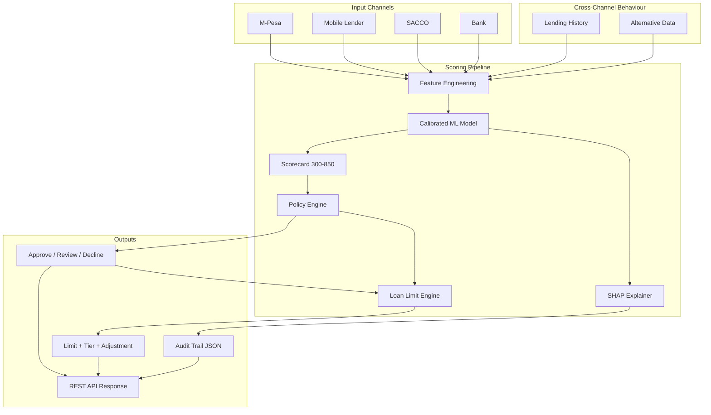
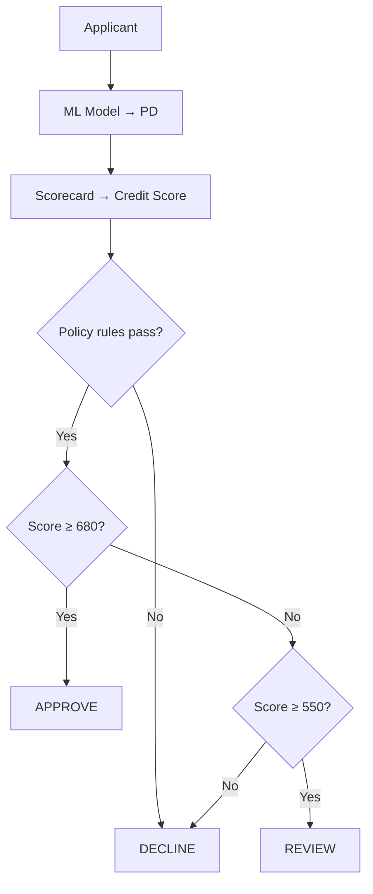

# East Africa Credit Scoring Engine

An **unbanked-first** credit scoring platform for East Africa. Most applicants have no traditional bank account — scoring relies on **M-Pesa**, **phone data** (SMS, call log, device tech), and **statements**, with **bank**, **SACCO**, and **CRB** data used when available.

It combines channel-specific feature engineering, a calibrated ML model, scorecard conversion (300–850), deterministic policy rules, **SHAP explainability**, loan limit assignment, and a **FastAPI REST service** with regulatory audit trails.

## Platform at a glance

| Capability | Status | Entry point |
|------------|--------|-------------|
| Multi-channel scoring (unbanked / M-Pesa / SACCO / bank / mobile lender) | ✅ | `score.py`, `/score` |
| Loan limit assignment (increase / decrease / maintain) | ✅ | `src/lending/limit_engine.py` |
| Borrowing & repayment history (all channels) | ✅ | `lending_history` in API |
| Phone data (SMS, call log, contacts, apps) | ✅ | `phone_data` in API, `src/data/phone_data.py` |
| ML training + evaluation (AUC, Gini, KS) | ✅ | `train.py` |
| Calibrated probability of default (PD) | ✅ | `src/ml/trainer.py` |
| Scorecard mapping (PDO methodology) | ✅ | `src/ml/scorer.py` |
| Policy engine (CRB, DTI, channel rules) | ✅ | `src/policy/engine.py` |
| SHAP feature explainability | ✅ | `src/ml/explainability.py` |
| Regulatory audit trail (JSON) | ✅ | `assets/audit_trails/` |
| FastAPI REST service | ✅ | `serve.py` → port 8000 |
| OpenAPI / Swagger docs | ✅ | `/docs` |
| Synthetic training data (no PII) | ✅ | `src/data/synthetic.py` |

## Supported channels

| Channel | `channel` value | API feature block | Examples |
|---------|-----------------|-------------------|----------|
| Unbanked (primary) | `unbanked` | `mpesa_features` + `phone_data` | No bank account; M-Pesa + phone only |
| M-Pesa mobile money | `mpesa` | `mpesa_features` | Telco-led lending, Fuliza |
| Mobile digital lender | `mobile_lender` | `mobile_lender_features` | App-based short-term lenders |
| SACCO | `sacco` | `sacco_features` | Stima, Harambee, Sheria SACCO |
| Bank | `bank` | `bank_features` | KCB, Equity, Co-op Bank |

## Data sources — statements, not third-party APIs

Other digital lenders **do not share internal platform data**. This platform is designed around what you can actually obtain:

| Source | Required for unbanked? | Used for |
|--------|------------------------|----------|
| **M-Pesa wallet** | Yes (primary rail) | `mpesa_features`, `has_mpesa_wallet` |
| **Phone (SMS, calls, device tech)** | Strongly recommended | `phone_data` → `sms` / `calls` / `device` |
| **Your loan ledger** | If repeat customer | `lending_history` |
| **M-Pesa statement** | Optional (cross-lender signals) | `mobile_lender_features` / statement parser |
| **Bank statement** | Optional | `bank_features` when `has_bank_account: 1` |
| **SACCO statement** | Optional | `sacco_features` when `has_sacco_membership: 1` |
| **CRB** | Optional | `crb_*` when `has_crb_record: 1` |

Set availability explicitly via the `data_sources` block:

```json
"data_sources": {
  "has_mpesa_wallet": 1.0,
  "has_phone_consent": 1.0,
  "has_bank_account": 0.0,
  "has_sacco_membership": 0.0,
  "has_crb_record": 0.0
}
```

Bank and SACCO features are **included in the score only when their flag is set** — unbanked applicants are not penalised for missing bank data.

The model uses **89 features** total: 8 common + 11 lending history + 5 data-source flags + 31 phone data + 34 channel-specific. Phone features are zeroed when consent is not granted.

## Architecture



| Layer | Module | Responsibility |
|-------|--------|----------------|
| **Feature engineering** | `src/features/engineering.py` | Channel-aware variables; masks inactive channel columns; respects alt-data consent |
| **ML model** | `src/ml/trainer.py` | Gradient boosting with sigmoid calibration |
| **Scorecard** | `src/ml/scorer.py` | PD → credit score using PDO (Points to Double Odds) |
| **Policy engine** | `src/policy/engine.py` | Hard rules: CRB defaults, DTI caps, channel minimums |
| **Loan limit engine** | `src/lending/limit_engine.py` | Assigns limits; increases/decreases from repayment patterns and alt data |
| **SHAP explainability** | `src/ml/explainability.py` | Per-feature risk contributions for audit/disclosure |
| **Audit trails** | `src/ml/explainability.py` | Timestamped JSON records for compliance review |
| **REST API** | `src/api/app.py` | Typed HTTP interface with Pydantic validation |

## End-to-end workflow

```
1. train.py          →  synthetic portfolio  →  train model  →  models/ + assets/
2. score.py          →  sample applicants    →  score + SHAP  →  assets/audit_trails/
3. serve.py          →  load latest model    →  REST API      →  live scoring + audits
```

## Channel coverage

One unified model serves all four channels. Channel-specific features are zeroed out for rows that do not belong to that channel, so each applicant is scored on the signals that matter for their lending path.

### M-Pesa (mobile money)

| Feature | Description |
|---------|-------------|
| `kyc_tier` | KYC verification level (1–3) |
| `wallet_activity_days_90d` | Active wallet days in last 90 days |
| `avg_monthly_txn_count` | Average monthly transaction count |
| `avg_txn_amount_kes` | Average transaction amount (KES) |
| `cash_in_out_ratio` | Cash-in vs cash-out ratio |
| `merchant_spend_ratio` | Share of spend at merchants |
| `fuliza_utilization` | Fuliza/overdraft utilization (0–1) |
| `wallet_balance_volatility` | Balance fluctuation measure |
| `days_since_last_txn` | Recency of last transaction |

**Policy checks:** minimum KYC tier (≥ 2), max Fuliza utilization (≤ 85%), minimum wallet activity (≥ 30 days in 90d).

| Config key | Threshold |
|------------|-----------|
| `min_kyc_tier` | 2 |
| `max_fuliza_utilization` | 0.85 |
| `min_wallet_activity_days_90d` | 30 |

### SACCO (co-operative lending)

| Feature | Description |
|---------|-------------|
| `membership_months` | Tenure as SACCO member |
| `share_capital_kes` | Share capital contributed (KES) |
| `monthly_savings_kes` | Regular monthly savings (KES) |
| `savings_consistency_score` | Consistency of savings (0–1) |
| `prior_loan_repayment_rate` | Historical repayment rate within SACCO |
| `guarantor_count` | Number of guarantors |
| `guarantor_avg_score` | Average guarantor credit score |
| `dividend_years` | Years dividends received |

**Policy checks:** minimum membership (≥ 6 months), share capital (≥ KES 5,000), repayment rate (≥ 85%).

| Config key | Threshold |
|------------|-----------|
| `min_membership_months` | 6 |
| `min_share_capital_kes` | 5,000 |
| `min_repayment_rate` | 0.85 |

### Bank (traditional lending)

| Feature | Description |
|---------|-------------|
| `account_age_months` | Account tenure |
| `avg_monthly_balance_kes` | Average monthly balance (KES) |
| `salary_deposit_regularity` | Regularity of salary deposits (0–1) |
| `bounced_cheques_12m` | Bounced cheques in last 12 months |
| `overdraft_usage_ratio` | Overdraft utilization (0–1) |
| `credit_card_utilization` | Credit card utilization (0–1) |
| `existing_loan_count` | Number of existing loans |
| `branch_relationship_score` | Bank branch relationship strength (0–1) |

**Policy checks:** minimum account age (≥ 6 months), max bounced cheques (≤ 1 in 12m), minimum balance (≥ KES 10,000).

| Config key | Threshold |
|------------|-----------|
| `min_account_age_months` | 6 |
| `max_bounced_cheques_12m` | 1 |
| `min_avg_balance_kes` | 10,000 |

### Mobile digital lender

Mobile lenders score applicants using **M-Pesa statements plus their own ledger** — not data from other fintech platforms. Competitor activity (disbursements, repayments, stacking) is inferred from M-Pesa paybill/till lines and SMS.

| Feature | Description | Source |
|---------|-------------|--------|
| `mpesa_statement_days_covered` | Days of M-Pesa statement provided | M-Pesa statement |
| `mpesa_lender_disbursement_count_12m` | Incoming loans from known lender paybills | M-Pesa statement |
| `mpesa_lender_repayment_count_12m` | Outgoing repayments to digital lenders | M-Pesa statement |
| `mpesa_inferred_repayment_rate` | Repayment vs disbursement ratio from statement | M-Pesa statement |
| `mpesa_active_lender_count` | Distinct lenders with recent debits/credits | M-Pesa statement |
| `mpesa_avg_inferred_loan_kes` | Average inferred loan size (KES) | M-Pesa statement |
| `mpesa_late_repayment_events_12m` | Late/overdue payment signals on statement | M-Pesa statement |
| `mpesa_loan_rollover_signals_12m` | Extension/rollover fee patterns | M-Pesa statement |
| `mpesa_net_cashflow_kes_90d` | Net inflow minus outflow (90 days) | M-Pesa statement |

**Policy checks:** minimum statement coverage (≥ 60 days), inferred repayment rate (≥ 80%), max active lenders (≤ 2), max late events (≤ 3 in 12m).

| Config key | Threshold |
|------------|-----------|
| `min_mpesa_statement_days_covered` | 60 |
| `min_mpesa_inferred_repayment_rate` | 0.80 |
| `max_mpesa_active_lender_count` | 2 |
| `max_mpesa_late_repayment_events_12m` | 3 |

**Typical use cases:**
- First-time vs repeat borrower limits on your platform
- Detecting **loan stacking** across multiple digital lenders
- Pricing repeat borrowers with strong platform repayment history
- Declining applicants with excessive rollovers or CRB defaults

### Common features (all channels)

| Feature | Description |
|---------|-------------|
| `age` | Applicant age |
| `monthly_income_kes` | Declared monthly income (KES) |
| `requested_amount_kes` | Loan amount requested (KES) |
| `existing_debt_kes` | Existing debt obligations (KES) |
| `debt_to_income` | Derived: existing debt / income |
| `loan_to_income` | Derived: requested amount / income |
| `crb_defaults` | Active CRB default listings |
| `crb_inquiries_6m` | CRB inquiries in last 6 months |

### Lending history (all channels)

**Your institution's loan ledger only** — banks, SACCOs, and lenders populate this from their own core banking / loan management system. Other institutions do not share this data.

Cross-institution borrowing behaviour is inferred separately from **M-Pesa statements** and **SMS** (see mobile lender features and `alternative_data`).

| Feature | Description |
|---------|-------------|
| `lifetime_loans_count` | Total loans taken across all lenders |
| `lifetime_loans_repaid_on_time` | Loans repaid on or before due date |
| `lifetime_default_count` | Lifetime defaults / write-offs |
| `lifetime_repayment_rate` | On-time repayments / total loans (0–1) |
| `on_time_repayment_streak` | Consecutive on-time loans (most recent first) |
| `avg_days_past_due` | Average days late when overdue |
| `days_since_last_loan` | Recency of last borrowing |
| `days_since_last_default` | Recency of last default (9999 if none) |
| `current_outstanding_kes` | Total outstanding debt (KES) |
| `highest_prior_limit_kes` | Highest limit previously granted (for adjustments) |
| `months_customer_relationship` | Months as a customer with your institution |

These features feed both the **ML model** (default risk) and the **loan limit engine** (increase/decrease logic).

### Phone data (SMS, call log, device — all channels)

Collected **on the applicant's phone** with explicit consent. No competitor APIs — the app reads SMS inbox, call history, contacts, and installed apps locally, then sends derived features to `/score`.

**API structure** (`phone_data` block):

```json
"phone_data": {
  "alternative_data_consent": 1.0,
  "sms": {
    "sms_salary_detected": 1.0,
    "sms_inferred_monthly_income_kes": 83300,
    "sms_mpesa_txn_count_30d": 72,
    "sms_total_count_30d": 118,
    "sms_bill_pay_regularity": 0.91,
    "sms_other_lender_repayment_count": 1,
    "sms_collection_message_count_30d": 0,
    "sms_lender_promo_count_30d": 1,
    "sms_gambling_ratio": 0.04,
    "income_declared_vs_sms_ratio": 0.98
  },
  "calls": {
    "call_total_count_30d": 64,
    "call_unique_contacts_30d": 28,
    "call_avg_duration_seconds": 145,
    "call_incoming_ratio": 0.62,
    "call_missed_ratio": 0.11,
    "call_collection_agency_count_30d": 0,
    "call_night_activity_ratio": 0.06
  },
  "device": {
    "device_tenure_days": 540,
    "contacts_count": 210,
    "contacts_saved_ratio": 0.88,
    "apps_lending_app_count": 1,
    "apps_gambling_app_count": 0,
    "device_os_android": 1.0,
    "device_os_version_score": 0.87,
    "device_tier": 2,
    "device_ram_gb": 4,
    "device_storage_free_ratio": 0.42,
    "device_dual_sim": 1.0,
    "device_network_4g_plus": 1.0,
    "device_model_age_months": 18
  }
}
```

| Group | Feature | Description |
|-------|---------|-------------|
| **SMS** | `sms_salary_detected` | Salary M-Pesa SMS pattern (0/1) |
| **SMS** | `sms_collection_message_count_30d` | Debt-collection SMS count |
| **SMS** | `sms_lender_promo_count_30d` | Loan marketing SMS (stacking signal) |
| **SMS** | `sms_gambling_ratio` | Gambling-related SMS share |
| **Calls** | `call_collection_agency_count_30d` | Calls from collectors / lenders |
| **Calls** | `call_missed_ratio` | Missed call ratio (stress proxy) |
| **Calls** | `call_night_activity_ratio` | Calls between 10pm–6am |
| **Device** | `contacts_count` | Phone book size |
| **Device** | `apps_lending_app_count` | Installed digital lending apps |
| **Device tech** | `device_os_android`, `device_os_version_score` | OS type and recency |
| **Device tech** | `device_tier`, `device_ram_gb` | Handset class (1=budget, 3=premium) and RAM |
| **Device tech** | `device_network_4g_plus`, `device_dual_sim` | Connectivity profile |
| **Device tech** | `device_model_age_months`, `device_storage_free_ratio` | Handset age and storage headroom |

Parse raw phone data with `src/data/phone_data.py` (`derive_phone_data_features()`). The legacy `alternative_data` API block still works as an alias.

## Loan limit engine

After scoring and policy checks, `LoanLimitEngine` assigns an **approved limit** (KES), a **tier**, and an **adjustment** action. The same engine works across all channels; limits are configured per channel in `config/scoring.yaml`.

| Adjustment | Meaning |
|------------|---------|
| `first_time` | No prior limit on record; starter limit from channel base |
| `increase` | New limit > 105% of prior limit (good streak / repayment) |
| `decrease` | New limit < 95% of prior limit (defaults, income cap, risk) |
| `maintain` | Within ±5% of prior limit |
| `suspended` | Decline or policy fail → limit KES 0 |

**Limit calculation flow:**

1. Start from `highest_prior_limit_kes` (repeat borrower) or `first_time_base_kes` (new borrower).
2. Apply score multiplier (`approve` 1.0, `review` 0.55, `decline` 0).
3. Adjust for repayment streak (3+ or 6+ on-time loans), lifetime rate, recent defaults.
4. Adjust for alt data (verified income ↑, gambling / loan-stacking apps ↓).
5. Cap at `max_income_multiple × monthly_income` (default 40% of income).
6. Clamp to channel min/max; round to nearest KES 500.
7. Compare to prior limit → `increase`, `decrease`, or `maintain`.

**Tiers** (by approved limit): starter → bronze (≥ 15k) → silver (≥ 50k) → gold (≥ 150k) → platinum (≥ 300k).

**Per-channel limits** (config defaults):

| Channel | Min (KES) | Max (KES) | First-time base (KES) |
|---------|-----------|-----------|------------------------|
| `mpesa` | 1,000 | 75,000 | 5,000 |
| `mobile_lender` | 500 | 100,000 | 3,000 |
| `sacco` | 5,000 | 500,000 | 25,000 |
| `bank` | 10,000 | 2,000,000 | 50,000 |

**Example:** MPESA-001 with income KES 85,000 and prior limit KES 40,000 may receive KES 34,000 with `DECREASE` because the **income cap** (40% × 85,000 = 34,000) binds before the prior limit — this is intentional conservative lending.


```
credit_scoring/
├── config/
│   └── scoring.yaml              # Thresholds, scorecard, channel rules
├── src/
│   ├── __init__.py
│   ├── config.py                 # Typed YAML config loader
│   ├── domain.py                 # Applicant, Decision, Policy models
│   ├── data/
│   │   ├── synthetic.py          # Synthetic portfolio generator
│   │   ├── statements.py         # M-Pesa statement → feature parser
│   │   └── phone_data.py         # SMS + call log → feature parser
│   ├── features/
│   │   └── engineering.py        # Feature matrix builder + channel masking
│   ├── ml/
│   │   ├── trainer.py            # Train, evaluate, persist model
│   │   ├── scorer.py             # Score applicants + audit integration
│   │   ├── explainability.py     # SHAP explainer + audit trail writer
│   │   └── metrics.py            # AUC, Gini, KS, Brier
│   ├── api/
│   │   ├── app.py                # FastAPI application
│   │   └── schemas.py            # Pydantic request/response models
│   ├── lending/
│   │   └── limit_engine.py       # Loan limit assign / adjust logic
│   ├── policy/
│       └── engine.py             # Business & regulatory rules
├── train.py                      # Training entry point
├── score.py                      # CLI scoring + SHAP + audit trails
├── serve.py                      # Start FastAPI on port 8000
├── models/                       # Saved models (generated)
│   ├── credit_model_*.joblib
│   ├── credit_model_*.json       # Model metadata
│   └── latest_model.txt          # Pointer to active model
├── assets/                       # Reports (generated)
│   ├── training_metrics.json
│   ├── feature_importance.csv
│   ├── roc_curve.png
│   ├── sample_decisions.json
│   └── audit_trails/             # Regulatory audit JSON per score
├── requirements.txt
├── .gitignore
└── README.md
```

## Requirements

- Python 3.10+
- scikit-learn, pandas, numpy, matplotlib, pyyaml, joblib
- fastapi, uvicorn, shap, pydantic

```bash
python3 -m venv .venv
source .venv/bin/activate        # Windows: .venv\Scripts\activate
pip install -r requirements.txt
```

`requirements.txt` includes: `scikit-learn`, `numpy`, `pandas`, `matplotlib`, `pyyaml`, `joblib`, `fastapi`, `uvicorn`, `shap`, `pydantic`.

> **Note:** Install `scikit-learn`, not the deprecated PyPI package `sklearn`.

## Quick start

```bash
# 1. Install dependencies
pip install -r requirements.txt

# 2. Train the model (required before scoring or API)
python3 train.py

# 3. Score sample applicants with SHAP + audit trails
python3 score.py

# 4. Start the REST API
python3 serve.py
# → http://127.0.0.1:8000/docs
```

---

## 1. Training (`train.py`)

Generates a synthetic portfolio and trains a calibrated gradient boosting classifier.

```bash
python3 train.py
```

**What it does:**

1. Generates 8,000 synthetic applicants (30% M-Pesa, 25% mobile lender, 25% SACCO, 20% bank).
2. Splits 80/20 train/test with stratification on default label.
3. Trains `GradientBoostingClassifier` wrapped in `CalibratedClassifierCV`.
4. Evaluates on hold-out test set.
5. Saves versioned artifacts to `models/` and `assets/`.

**Latest training metrics** (synthetic portfolio):

| Metric | Value |
|--------|-------|
| ROC-AUC | 0.910 |
| Gini | 0.821 |
| KS | 0.811 |
| Brier score | 0.058 |
| Test accuracy | 0.903 |
| Precision | 0.573 |
| Recall | 0.734 |
| Default rate | 12% |
| Feature count | 89 |
| Model version | 2.3.0 |
| Train / test split | 6,400 / 1,600 |

**Generated artifacts:**

| File | Contents |
|------|----------|
| `models/credit_model_*.joblib` | Serialized sklearn pipeline |
| `models/credit_model_*.json` | Feature list, scorecard, metrics |
| `models/latest_model.txt` | Pointer to active model |
| `assets/training_metrics.json` | Full evaluation report |
| `assets/feature_importance.csv` | Model feature importances |
| `assets/roc_curve.png` | ROC curve plot |

---

## 2. CLI scoring (`score.py`)

Scores six sample applicants across all channels — including **mobile digital lender** cases — plus high-risk M-Pesa and mobile lender scenarios. Each score includes SHAP explainability and a persisted audit trail.

```bash
python3 score.py
```

**Sample output:**

```
MPESA-001      | channel=mpesa         | score=687 | limit=KES 34,000 | DECREASE  | decision=APPROVE
SACCO-014      | channel=sacco         | score=687 | limit=KES 48,000 | DECREASE  | decision=APPROVE
BANK-203       | channel=bank          | score=687 | limit=KES 84,000 | DECREASE  | decision=APPROVE
MOBLEND-001    | channel=mobile_lender | score=687 | limit=KES 19,000 | MAINTAIN  | decision=APPROVE
MOBLEND-RISK-99 | channel=mobile_lender | score=561 | limit=KES 0      | SUSPENDED | decision=DECLINE
MPESA-RISK-77  | channel=mpesa         | score=548 | limit=KES 0      | SUSPENDED | decision=DECLINE
```

Re-run `python3 train.py` then `python3 score.py` after config or feature changes to refresh scores.

**Sample applicants scored by `score.py`:**

| ID | Channel | Scenario |
|----|---------|----------|
| `MPESA-001` | `mpesa` | Strong M-Pesa wallet profile → APPROVE |
| `SACCO-014` | `sacco` | Long-tenure SACCO member → APPROVE |
| `BANK-203` | `bank` | Solid bank relationship + strong history → APPROVE |
| `MOBLEND-001` | `mobile_lender` | Repeat digital-lender borrower → APPROVE |
| `MOBLEND-RISK-99` | `mobile_lender` | Loan stacking + CRB default → DECLINE |
| `MPESA-RISK-77` | `mpesa` | High Fuliza use + CRB default → DECLINE |

**Generated artifacts:**

| File | Contents |
|------|----------|
| `assets/sample_decisions.json` | All sample scores with SHAP payloads |
| `assets/audit_trails/{audit_id}.json` | One regulatory audit file per applicant |

---

## 3. REST API (`serve.py`)

Production-ready FastAPI service that loads the latest trained model at startup.

```bash
python3 serve.py
```

- **Swagger UI:** [http://127.0.0.1:8000/docs](http://127.0.0.1:8000/docs)
- **ReDoc:** [http://127.0.0.1:8000/redoc](http://127.0.0.1:8000/redoc)
- **Base URL:** `http://127.0.0.1:8000`

### Endpoints

| Endpoint | Method | Description |
|----------|--------|-------------|
| `/health` | GET | Service health and model load status |
| `/model/info` | GET | Active model version, scorecard, decision bands |
| `/score` | POST | Score one applicant (SHAP + audit optional) |
| `/score/batch` | POST | Score up to 100 applicants in one request |

### `GET /health`

```bash
curl http://127.0.0.1:8000/health
```

```json
{
  "status": "ok",
  "model_loaded": true,
  "model_version": "2.1.0"
}
```

### `GET /model/info`

```bash
curl http://127.0.0.1:8000/model/info
```

Returns project name, model file, feature count, scorecard settings, and decision bands.

### `POST /score`

Score a single applicant. Every request should include **`lending_history`** (borrowing/repayment ledger) and optionally **`alternative_data`** (phone signals with consent). Set `include_shap: true` and `persist_audit_trail: true` for full regulatory output.

**Shared blocks** (all channels):

```json
"lending_history": {
  "lifetime_loans_count": 10,
  "lifetime_loans_repaid_on_time": 10,
  "lifetime_default_count": 0,
  "lifetime_repayment_rate": 1.0,
  "on_time_repayment_streak": 7,
  "avg_days_past_due": 0.5,
  "days_since_last_loan": 20,
  "days_since_last_default": 9999,
  "current_outstanding_kes": 8000,
  "highest_prior_limit_kes": 40000,
  "months_customer_relationship": 24
},
"alternative_data": {
  "alternative_data_consent": 1.0,
  "sms_salary_detected": 1.0,
  "sms_inferred_monthly_income_kes": 83300,
  "sms_mpesa_txn_count_30d": 72,
  "sms_bill_pay_regularity": 0.91,
  "sms_other_lender_repayment_count": 1,
  "sms_gambling_ratio": 0.04,
  "apps_lending_app_count": 1,
  "apps_gambling_app_count": 0,
  "income_declared_vs_sms_ratio": 0.98,
  "device_tenure_days": 540
}
```

**M-Pesa example:**

```bash
curl -X POST http://127.0.0.1:8000/score \
  -H "Content-Type: application/json" \
  -d '{
    "applicant_id": "MPESA-001",
    "channel": "mpesa",
    "age": 34,
    "monthly_income_kes": 85000,
    "requested_amount_kes": 50000,
    "existing_debt_kes": 5000,
    "crb_defaults": 0,
    "crb_inquiries_6m": 0,
    "include_shap": true,
    "persist_audit_trail": true,
    "lending_history": {
      "lifetime_loans_count": 10,
      "lifetime_repayment_rate": 1.0,
      "on_time_repayment_streak": 7,
      "highest_prior_limit_kes": 40000,
      "lifetime_default_count": 0,
      "days_since_last_default": 9999
    },
    "alternative_data": {
      "alternative_data_consent": 1.0,
      "sms_salary_detected": 1.0,
      "sms_inferred_monthly_income_kes": 83300,
      "income_declared_vs_sms_ratio": 0.98,
      "sms_gambling_ratio": 0.04,
      "apps_lending_app_count": 1
    },
    "mpesa_features": {
      "kyc_tier": 3,
      "wallet_activity_days_90d": 88,
      "avg_monthly_txn_count": 95,
      "avg_txn_amount_kes": 4200,
      "cash_in_out_ratio": 0.95,
      "merchant_spend_ratio": 0.35,
      "fuliza_utilization": 0.05,
      "wallet_balance_volatility": 0.08,
      "days_since_last_txn": 0
    }
  }'
```

**SACCO example** — use `"channel": "sacco"` and provide `sacco_features`:

```json
"sacco_features": {
  "membership_months": 72,
  "share_capital_kes": 95000,
  "monthly_savings_kes": 18000,
  "savings_consistency_score": 0.97,
  "prior_loan_repayment_rate": 1.0,
  "guarantor_count": 4,
  "guarantor_avg_score": 760,
  "dividend_years": 6
}
```

**Bank example** — use `"channel": "bank"` and provide `bank_features`:

```json
"bank_features": {
  "account_age_months": 60,
  "avg_monthly_balance_kes": 280000,
  "salary_deposit_regularity": 0.98,
  "bounced_cheques_12m": 0,
  "overdraft_usage_ratio": 0.03,
  "credit_card_utilization": 0.12,
  "existing_loan_count": 0,
  "branch_relationship_score": 0.91
}
```

**Mobile digital lender example** — use `"channel": "mobile_lender"` and provide `mobile_lender_features`:

```bash
curl -X POST http://127.0.0.1:8000/score \
  -H "Content-Type: application/json" \
  -d '{
    "applicant_id": "MOBLEND-001",
    "channel": "mobile_lender",
    "age": 31,
    "monthly_income_kes": 48000,
    "requested_amount_kes": 15000,
    "existing_debt_kes": 8000,
    "crb_defaults": 0,
    "crb_inquiries_6m": 1,
    "include_shap": true,
    "persist_audit_trail": true,
    "lending_history": {
      "lifetime_loans_count": 8,
      "lifetime_repayment_rate": 0.96,
      "on_time_repayment_streak": 5,
      "highest_prior_limit_kes": 20000
    },
    "alternative_data": {
      "alternative_data_consent": 1.0,
      "sms_salary_detected": 1.0,
      "sms_inferred_monthly_income_kes": 47000,
      "income_declared_vs_sms_ratio": 0.98,
      "apps_lending_app_count": 1
    },
    "mobile_lender_features": {
      "mpesa_statement_days_covered": 270,
      "mpesa_lender_disbursement_count_12m": 8,
      "mpesa_lender_repayment_count_12m": 9,
      "mpesa_inferred_repayment_rate": 0.96,
      "mpesa_active_lender_count": 1,
      "mpesa_avg_inferred_loan_kes": 12000,
      "mpesa_late_repayment_events_12m": 0,
      "mpesa_loan_rollover_signals_12m": 1,
      "mpesa_net_cashflow_kes_90d": 18500
    }
  }'
```

**Response fields:**

| Field | Description |
|-------|-------------|
| `probability_of_default` | Model-estimated PD (0–1) |
| `credit_score` | Scorecard score (300–850) |
| `decision` | `approve`, `review`, or `decline` |
| `policy.passed` | Whether hard policy rules passed |
| `policy.reasons` | Policy decline reasons (if any) |
| `loan_limit.approved_limit_kes` | Assigned loan limit (KES) |
| `loan_limit.adjustment` | `first_time`, `increase`, `decrease`, `maintain`, or `suspended` |
| `loan_limit.tier` | Limit tier: starter / bronze / silver / gold / platinum |
| `loan_limit.reasons` | Human-readable limit adjustment reasons |
| `loan_limit.next_review_days` | Days until limit re-evaluation |
| `top_risk_factors` | Rule-based risk factor summary |
| `shap` | SHAP explanation (if requested) |
| `audit_id` | Audit trail ID (if persisted) |
| `model_version` | Model version used for the decision |

**Example response (truncated):**

```json
{
  "applicant_id": "MOBLEND-001",
  "channel": "mobile_lender",
  "probability_of_default": 0.0162,
  "credit_score": 687,
  "decision": "approve",
  "policy": { "passed": true, "reasons": [] },
  "loan_limit": {
    "approved_limit_kes": 19000,
    "min_limit_kes": 500,
    "max_limit_kes": 100000,
    "prior_limit_kes": 20000,
    "requested_limit_kes": 15000,
    "adjustment": "maintain",
    "adjustment_pct": 0.0,
    "tier": "bronze",
    "reasons": ["Limit maintained based on current behaviour."],
    "next_review_days": 90
  },
  "shap": {
    "base_value": -3.529231,
    "predicted_log_odds": -4.412,
    "summary": "Primary drivers increasing default risk: none. Primary drivers reducing risk: mpesa_inferred_repayment_rate, lifetime_repayment_rate.",
    "contributions": [
      {
        "feature": "mpesa_inferred_repayment_rate",
        "raw_value": 0.96,
        "shap_value": -0.42,
        "impact": "decreases_default_risk"
      }
    ]
  },
  "audit_id": "MOBLEND-001-4fddb337",
  "model_version": "2.1.0"
}
```

### `POST /score/batch`

Score multiple applicants in one call. Batch defaults: `include_shap: false`, `persist_audit_trail: false` (override per applicant if needed).

```bash
curl -X POST http://127.0.0.1:8000/score/batch \
  -H "Content-Type: application/json" \
  -d '{
    "include_shap": false,
    "persist_audit_trail": false,
    "applicants": [
      {
        "applicant_id": "MPESA-001",
        "channel": "mpesa",
        "age": 34,
        "monthly_income_kes": 85000,
        "requested_amount_kes": 50000,
        "existing_debt_kes": 5000,
        "crb_defaults": 0,
        "crb_inquiries_6m": 0,
        "mpesa_features": { "...": "..." }
      }
    ]
  }'
```

---

## Decision logic

Final decisions combine **three independent layers**:



| Decision | Condition |
|----------|-----------|
| **APPROVE** | Policy passed **and** credit score ≥ 680 |
| **REVIEW** | Policy passed **and** 550 ≤ score < 680 |
| **DECLINE** | Policy failed **or** score < 550 |

Policy failures always result in **DECLINE**, regardless of credit score. Examples:

- Active **CRB default** (all channels)
- **Debt-to-income** above 45% (all channels)
- M-Pesa **KYC tier** too low or **Fuliza** over-utilised
- SACCO **membership** or **share capital** below minimum
- Bank **bounced cheques** or low average balance
- Mobile lender **loan stacking** (too many active digital loans) or **excessive rollovers**

### Scorecard formula

Credit scores use the industry-standard **PDO (Points to Double Odds)** method:

\[
\text{Score} = \text{Offset} + \text{Factor} \times \ln(\text{odds})
\]

where `Factor = PDO / ln(2)`, `Offset = base_score − Factor × ln(base_odds)`, and `odds = PD / (1 − PD)`.

Current settings (`config/scoring.yaml`):

| Setting | Value |
|---------|-------|
| Base score | 680 |
| Base odds | 50:1 |
| PDO | 20 |
| Score range | 300–850 |
| Approve band | ≥ 680 |
| Review band | ≥ 550 |

---

## SHAP explainability & audit trails

Every score can include a **SHAP (SHapley Additive exPlanations)** breakdown showing which features pushed default probability up or down. This supports:

- **CBK model risk management** guidelines
- **Consumer disclosure** (why was my application declined?)
- **Internal audit** and fair-lending reviews

### How SHAP is used here

1. Applicant features are preprocessed through the same pipeline used at training time.
2. The explainer is chosen from the trained base model:
   - `TreeExplainer` for gradient boosting
   - `LinearExplainer` for logistic regression
3. Only **common + lending history + alternative data (if consented) + channel-specific** features for the applicant's channel are included (no cross-channel leakage).
4. Top contributions are ranked by absolute impact.
5. A plain-language `summary` is generated for non-technical reviewers.

| `shap_value` sign | Meaning |
|-------------------|---------|
| **Positive** | Feature **increases** default risk |
| **Negative** | Feature **decreases** default risk |

**Important:** SHAP attributions explain the **underlying base classifier** (pre-calibration log-odds). The credit score uses the **calibrated** probability of default. The `explanation_scope` field in each audit trail documents this distinction.

### Audit trail format

When `persist_audit_trail: true`, a JSON file is written to `assets/audit_trails/{audit_id}.json`:

| Field | Purpose |
|-------|---------|
| `audit_id` | Unique ID for compliance lookups (e.g. `MPESA-001-86f743a6`) |
| `scored_at` | UTC timestamp of the decision |
| `model_version` | Model version that produced the score |
| `applicant_id` | Applicant identifier |
| `channel` | Lending channel (`mpesa`, `sacco`, `bank`, `mobile_lender`) |
| `probability_of_default` | Final **calibrated** PD used for scorecard |
| `credit_score` | Final scorecard score |
| `decision` | Final decision (`approve` / `review` / `decline`) |
| `policy_passed` | Whether policy rules passed |
| `policy_reasons` | Hard-rule decline reasons (independent of ML) |
| `shap.contributions` | Top feature impacts (channel-scoped only) |
| `shap.summary` | Plain-language explanation |
| `shap.explanation_scope` | Notes that SHAP reflects pre-calibration base model |
| `request_snapshot` | Input payload used for the decision |

---

## Configuration

All thresholds live in `config/scoring.yaml` — no magic numbers in code.

```yaml
data:
  n_samples: 8000
  default_rate: 0.12
  channel_distribution:
    mpesa: 0.30
    mobile_lender: 0.25
    sacco: 0.25
    bank: 0.20

channel_minimums:
  mobile_lender:
    min_platform_tenure_months: 1
    min_platform_repayment_rate: 0.80
    max_active_digital_loans: 2
    max_rollover_count_12m: 3
```

```yaml
# Other key sections
scorecard:          # PDO scorecard settings
decision_bands:     # approve / review thresholds
policy:             # Global rules (age, DTI, CRB, income)
channel_minimums:   # Per-channel rules (all four channels)
training:           # Model type, calibration, test split
```

| Section | What to tune |
|---------|--------------|
| `data.channel_distribution` | Mix: 30% M-Pesa, 25% mobile lender, 25% SACCO, 20% bank |
| `scorecard` | Base score, PDO, min/max score bounds |
| `decision_bands` | Approve (≥ 680) and review (≥ 550) thresholds |
| `policy` | Minimum age (18), max DTI (45%), CRB defaults (0), income floor (KES 15,000) |
| `channel_minimums.mpesa` | KYC tier, Fuliza cap, wallet activity |
| `channel_minimums.sacco` | Membership months, share capital, repayment rate |
| `channel_minimums.bank` | Account age, bounced cheques, min balance |
| `channel_minimums.mobile_lender` | M-Pesa statement coverage, inferred repayment, lender stacking |
| `loan_limits` | Per-channel min/max/first-time base, score multipliers, repayment & alt-data adjustments, tiers |
| `training.model_type` | `gradient_boosting` or `logistic_regression` |

After changing config or adding channels, re-run `python3 train.py` to retrain (feature count must match saved model).

---

## Key metrics

| Metric | Meaning | Latest value |
|--------|---------|--------------|
| **ROC-AUC** | Ranking quality of default vs non-default | 0.910 |
| **Gini** | `2 × AUC − 1`; higher = better separation | 0.821 |
| **KS** | Maximum separation between score distributions | 0.811 |
| **Brier** | Calibration error of predicted probabilities | 0.058 |
| **Precision** | Of predicted defaults, how many are actual defaults | 0.573 |
| **Recall** | Of actual defaults, how many the model catches | 0.734 |
| **Features** | Total model input columns | 89 |

---

## Design decisions

1. **Separation of ML and policy** — the model estimates risk; hard rules enforce compliance independently. A high score cannot override an active CRB default.
2. **Channel masking** — one unified model serves M-Pesa, SACCO, bank, and mobile digital lenders by zeroing irrelevant channel features per row.
3. **Calibrated probabilities** — `CalibratedClassifierCV` (sigmoid) improves PD reliability before scorecard mapping.
4. **Versioned artifacts** — each training run saves a timestamped model, metadata JSON, and feature importance CSV.
5. **SHAP audit trails** — every API or CLI score can persist a JSON audit file with feature-level explanations.
6. **Loan limit engine** — separate from the ML score; limits increase or decrease from repayment streaks, defaults, income caps, and phone-derived signals.
7. **FastAPI + Pydantic** — typed request validation per channel; invalid payloads are rejected before scoring.
8. **Statement-first design** — competitor fintech APIs are not assumed; cross-lender signals come from customer M-Pesa/bank/SACCO statements.
9. **Synthetic data only** — no real customer PII. Replace `src/data/synthetic.py` with your ETL/CRB pipeline in production.

---

## Roadmap

### Built ✅

- Multi-channel feature engineering (M-Pesa, SACCO, bank, **mobile digital lenders**)
- **Phone data** (SMS, call log, contacts, apps) — 76 total features
- **Loan limit engine** with increase/decrease/maintain/suspend logic
- Training pipeline with Gini, KS, Brier evaluation
- Scorecard conversion (300–850, PDO)
- Policy engine with channel-specific rules
- SHAP explainability with audit trail persistence
- FastAPI REST service with Swagger docs
- CLI scoring with **six sample applicants** (all four channels + two high-risk cases)

### Next steps

- Connect to CRB APIs (Metropol, TransUnion Kenya) for live bureau data
- Replace synthetic generator with feature store / data warehouse pipelines
- MLflow model registry and A/B testing between model versions
- API authentication (OAuth2 / API keys) and rate limiting
- Monitor PSI (Population Stability Index) and recalibrate quarterly
- Deploy to cloud (Docker + Kubernetes or managed container service)

---

## Author

**Duncan Mwirigi**  
GitHub: [github.com/duncanmwirigi](https://github.com/duncanmwirigi)  
X: https://x.com/AIStiqDan  
Website: https://bytecityinc.com

## License

MIT — use and modify freely for learning and projects.
